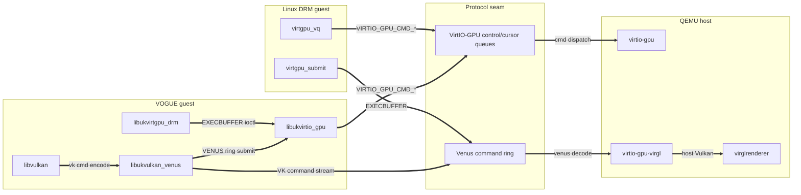

# VOGUE architecture and artifact taxonomy

The evidence matrix (`results/vogue_evaluation_matrix.json`) is the
source of truth for PASS versus `blocked:*` status. The codebase is intentionally
small: local Unikraft libraries provide device/compatibility glue; upstream
application projects keep their own application semantics.

## Runtime stack

```text
application port (kmscube/vkmark/llama.cpp)
  -> bounded Unikraft compatibility shim
  -> libukvirtio_gpu real frontend
  -> VirtIO-GPU controlq/cursorq + resources/fences/capsets/blobs
  -> QEMU virglrenderer / Venus
  -> host GL/Vulkan driver
```

The project does not import Linux DRM/KMS or Mesa into the guest. It implements
only the bounded interfaces needed by the artifact rows.

## Dependency graph

The maintained architecture below documents the build and runtime boundaries
directly. The former generated graph artifacts were removed because they had
no active producer or validation target.

View C — the shared protocol contract that both guests speak to QEMU:



## llama.cpp taxonomy

| Class | Surface | Purpose | Evidence status |
|---|---|---|---|
| CPU single-app | `apps/app-llama-cpu`, `kraft/Kraftfile.llama-cpu-bench`, `kraft/Kraftfile.llama-cpu-server` | Unmodified upstream llama.cpp bench-only or server-only Unikraft image. | `llm.bench.cpu` pass or structured blocker. |
| Vulkan single-app | `apps/app-llama-vk`, `kraft/Kraftfile.llama-vk` | Unmodified upstream llama.cpp Vulkan path through `libvulkan` (vk* ABI) → `libukvulkan_venus` (Venus driver). | `llm.bench.vk` / `llm.bench.vk.real` pass or structured blocker. |
| Vulkan ABI / driver | `libs/libvulkan`, `libs/libukvulkan_venus` | `libvulkan` owns the app-facing `vk*` ABI + Vulkan-Hpp dispatch (compute-first subset); `libukvulkan_venus` is the statically linked Venus driver. | `vk.ggml-dispatch` PASS. |
| ggml-vulkan build glue | `apps/app-llama-vk/Makefile.uk` | Builds upstream `ggml-vulkan.cpp` + ggml core + SPIR-V shader blobs in-tree (the former `libukggml_vk` helper was retired); resolves the `vk*` ABI against `libvulkan`. | `vk.ggml-dispatch` PASS. |
| Environment matrix | `config/llama_env_matrix.json` | Baremetal/QEMU/Unikraft CPU/Vulkan/CUDA runs with explicit threads and args. | Dry-run/execute artifacts under `results/llama-env/`. |

Synthetic local llama libraries and apps were removed: no local GGUF framework,
custom ggml substrate, or llama runtime remains under `libs/` or `apps/`.

## Evidence ladder for ggml-vulkan

1. `make llama-vulkan-api-coverage`: upstream `ggml-vulkan.cpp` required Vulkan calls are present in the static dispatch table.
2. `make llama-ggml-vk-dispatch`: host fake-backend dispatch test; no QEMU or GPU throughput claim.
3. `make llama-vk-build`: Unikraft image links upstream ggml-vulkan/Venus libraries.
4. `make llama-vk-run`: QEMU runtime; may return `blocked:no-egl-render-node` or another structured blocker.
5. Only a same-run runtime PASS may support guest GPU inference claims.

## Reviewer targets

- `make artifact-smoke`: quick no-QEMU structure/native/API/docs gate.
- `make artifact-functional`: smoke + host Vulkan/app/eval/current-stage gates.
- `make artifact-full`: functional + host-dependent QEMU/Venus/llama Vulkan gates.
