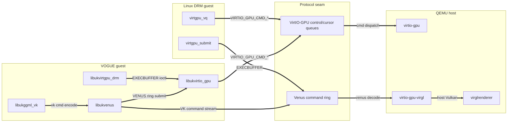

# VOGUE architecture and artifact taxonomy

The evidence matrix (`results/vogue_latest_evaluation_matrix.json`) is the
source of truth for PASS versus `blocked:*` status. The codebase is intentionally
small: local Unikraft libraries provide device/compatibility glue; upstream
application projects keep their own application semantics.

## Runtime stack

```text
application port (kmscube/glmark2/vkmark/llama.cpp)
  -> bounded Unikraft compatibility shim
  -> libukvirtio_gpu real frontend
  -> VirtIO-GPU controlq/cursorq + resources/fences/capsets/blobs
  -> QEMU virglrenderer / Venus
  -> host GL/Vulkan driver
```

The project does not import Linux DRM/KMS or Mesa into the guest. It implements
only the bounded interfaces needed by the artifact rows.

## Dependency graph

`make depgraph` (`scripts/gen_depgraph.py`, design in
`docs/dependency-graph-plan.md`) extracts the virtio-gpu dependency multigraph
across three codebases and one protocol seam — the Linux guest driver
(`../linux/drivers/gpu/drm/virtio`), our VOGUE `libs/*`, and the QEMU device
model (`../qemu-src/hw/display`) — directly from their `Kconfig`/`Config.uk`,
`Makefile`/`meson.build`, and `#include` graphs. Edges are typed `build`
(dashed), `compile` (blue), and `runtime` (bold). Artifacts and full catalogue
live in [`results/depgraph/`](../results/depgraph/README.md):

| View | Insight | Files |
|---|---|---|
| A — The Collapse | Linux links 13 DRM/KMS/GEM objects + subsystem `select`s; VOGUE reaches the same seam through a thin `libuk*` chain, depending on **none** of that tower. | `results/depgraph/view-a-collapse.{svg,mmd}` |
| B — Three Kinds of One Edge | Where build wiring diverges from the runtime hot path on the VOGUE Vulkan chain. | `results/depgraph/view-b-edge-kinds.{svg,mmd}` |
| C — The Invariant Spine | Linux **and** VOGUE emit the same `VIRTIO_GPU_CMD_*`/Venus opcodes that QEMU consumes — interchangeable guests, one host contract. | `results/depgraph/view-c-spine.{svg,mmd}` |

View C — the shared protocol contract that both guests speak to QEMU:



Regenerate with `make depgraph`; `make depgraph-check` is the drift gate.

## llama.cpp taxonomy

| Class | Surface | Purpose | Evidence status |
|---|---|---|---|
| CPU single-app | `apps/app-llama-upstream`, `kraft/Kraftfile.llama-upstream-bench`, `kraft/Kraftfile.llama-upstream-server` | Unmodified upstream llama.cpp bench-only or server-only Unikraft image. | `llm.bench.cpu` pass or structured blocker. |
| Vulkan single-app | `apps/app-llama-upstream-vk`, `kraft/Kraftfile.llama-upstream-vk` | Unmodified upstream llama.cpp Vulkan path through `libukggml_vulkan` and Venus. | `llm.bench.vk` / `llm.bench.vk.real` pass or structured blocker. |
| Minimal local support | `libs/libukggml_vk` | Static Vulkan loader/dispatch, Venus bridge, and SPIR-V shader-object wiring for upstream `ggml-vulkan.cpp`. | `vk.ggml-dispatch` PASS. |
| Environment matrix | `config/llama_env_matrix.json` | Baremetal/QEMU/Unikraft CPU/Vulkan/CUDA runs with explicit threads and args. | Dry-run/execute artifacts under `results/llama-env/`. |

Synthetic local llama libraries and apps were removed: no local GGUF framework,
custom ggml substrate, or llama runtime remains under `libs/` or `apps/`.

## Evidence ladder for ggml-vulkan

1. `make llama-vulkan-api-coverage`: upstream `ggml-vulkan.cpp` required Vulkan calls are present in the static dispatch table.
2. `make llama-ggml-vk-dispatch`: host fake-backend dispatch test; no QEMU or GPU throughput claim.
3. `make llama-upstream-vk-build`: Unikraft image links upstream ggml-vulkan/Venus libraries.
4. `make llama-upstream-vk-run`: QEMU runtime; may return `blocked:no-egl-render-node` or another structured blocker.
5. Only a same-run runtime PASS may support guest GPU inference claims.

## Reviewer targets

- `make artifact-smoke`: quick no-QEMU structure/native/API/docs gate.
- `make artifact-functional`: smoke + host Vulkan/app/eval/current-stage gates.
- `make artifact-full`: functional + host-dependent QEMU/Venus/llama Vulkan gates.
- `make artifact-paper`: paper consistency and PDF build.
