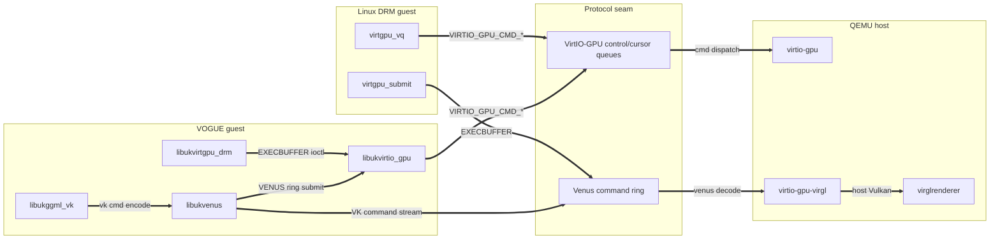

# VirtIO-GPU Cross-Boundary Dependency Graph

Generated by `scripts/gen_depgraph.py` (`make depgraph`). Implements
`docs/plans/dependency-graph-plan.md`. **Do not edit by hand** — regenerate.

A directed multigraph of every virtio-gpu dependency across three codebases and
one protocol seam, extracted from the real sources:

- **Linux guest** — `../linux/drivers/gpu/drm/virtio` (`CONFIG_DRM_VIRTIO_GPU`)
- **VOGUE guest** — `virtio-gpu/libs/*` (our Unikraft libuk* static dispatch)
- **Protocol seam** — VirtIO-GPU control/cursor queues + Venus command ring
- **QEMU host** — `../qemu-src/hw/display/virtio-gpu-*.c` + virglrenderer

Edges carry a **kind**, rendered with distinct styles:

| kind | meaning | source of truth | dot style | mermaid |
|------|---------|-----------------|-----------|---------|
| `build` | linked at build time | Kconfig `select` / `Config.uk` / meson `source_set` | dashed grey | `-.->` |
| `compile` | `#include` reachability | source `#include` scan | blue | `-->` |
| `runtime` | virtqueue / ring command flow | curated + cited (`edges.json:runtime_citations`) | bold red | `==>` |

Current dataset (see `edges.json` `counts`): **64 nodes, 109 edges**
(47 build, 52 compile, 10 runtime). Provenance commits of all three checkouts
are recorded in `edges.json:provenance`.

## Files

| File | Content |
|------|---------|
| `edges.json` | normalized dataset (nodes, edges, provenance, runtime citations) |
| `linux.dot` / `vogue.dot` / `qemu.dot` (+`.svg`) | per-codebase graphs |
| `view-a-collapse.{dot,mmd,svg}` | **View A** — Linux DRM tower vs VOGUE dispatch |
| `view-b-edge-kinds.{dot,mmd,svg}` | **View B** — build/compile/runtime overlay |
| `view-c-spine.{dot,mmd,svg}` | **View C** — shared protocol opcode map |

`.svg` is rendered when Graphviz `dot` is installed; the `.mmd` mirrors below
render inline on GitHub with no tooling.

## The insight: three views, not one diagram

### View A — The Collapse
Linux links **13 objects** and `select`s the whole DRM/KMS/GEM/`VIRTIO_DMA_SHARED_BUFFER`
subsystem tower. VOGUE reaches the *same protocol seam* through a thin chain of
purpose-built libs and **does not depend** on DRM core, KMS atomic helpers, the
GEM shmem helper, fbdev, or debugfs for the Vulkan-compute path. View A draws
both subgraphs side-by-side against the shared seam so the eliminated
dependencies are visible as the absent Linux subsystem nodes. (See
`view-a-collapse.svg` — large; best viewed rendered.)

### View B — Three Kinds of One Edge
The VOGUE Vulkan hot path, with `build` (dashed), `compile` (thin), and
`runtime` (bold) edges overlaid. Shows where build wiring and the runtime hot
path diverge: `libukggml_vk` build-`select`s four libs, but at runtime the hot
path is `ggml_vk → venus → virtio_gpu → virtqueue`.

### View C — The Invariant Protocol Spine
Both guests (Linux **and** VOGUE) produce the *same* `VIRTIO_GPU_CMD_*` /
`EXECBUFFER` / Venus opcodes into the seam; QEMU consumes them. This proves the
two guests are interchangeable against one host contract, and doubles as an
opcode conformance checklist.



## Reproduce / verify

```sh
make depgraph         # regenerate dataset + .dot/.mmd, render .svg if `dot` present
make depgraph-check   # CI gate: fail if edges.json drifts from the committed copy
```
